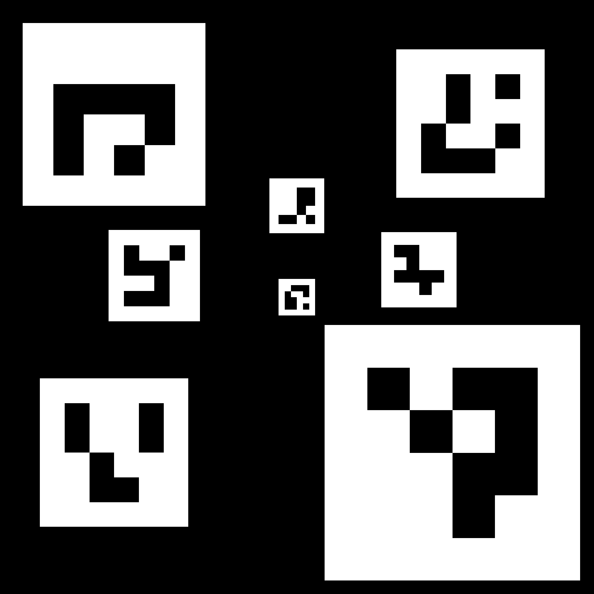

# Test camera stream

Check camera is connected and working:

```
ls -l /dev/video*
sudo apt update
sudo apt install -y v4l-utils ffmpeg
v4l2-ctl --list-devices
# capture a test frame
ffmpeg -f v4l2 -video_size 640x480 -i /dev/video0 -vframes 1 out.jpg
file out.jpg
```

Run ffmpeg on RPI:

```
ffmpeg -f v4l2 -framerate 30 -video_size 1280x720 -i /dev/video0   -c:v h264_v4l2m2m -b:v 3M -pix_fmt yuv420p -tune zerolatency -g 30 -keyint_min 30   -f mpegts "udp://10.95.1.72:5000?pkt_size=1316"
```

Receive videostream on windows using VLC: Open URL: `udp://@:5000`

# ArUco Landing Pad Detector – ROS 2 Humble




`landing_detector_node` detects an ArUco board that encodes your landing pad, publishes its pose in **ENU/map** coordinates, and provides a TF from `camera_link` to `landing_pad`.  It is designed for UAV precision‑landing stacks using **PX4 + MAVROS**.

---

## Features

| ✔ | Functionality |
|---|---------------|
| ✅ | ArUco marker & board detection with **OpenCV 4** |
| ✅ | Pose estimation with `cv::aruco::estimatePoseBoard` |
| ✅ | Publishes `geometry_msgs/PoseStamped` → `landing_pad/pose` |
| ✅ | Broadcasts TF: `camera_link → landing_pad` (+ intermediate board frame) |
| ✅ | Loads board geometry from **YAML / JSON** config file |
| ✅ | All topics/frames/configurable via ROS 2 parameters |

---

## Quick Start

```bash
# buil depends
sudo apt install nlohmann-json3-dev

# 1. Build the package (inside your ROS 2 Humble workspace)
cd ~/ros2_ws
colcon build --symlink-install --packages-select aruco_tracker
source install/setup.bash

# 2. Launch the node (camera topics must already be published)
ros2 launch aruco_tracker landing_detector.launch.py


#### Run the simulation environment
Launch PX4 sim
```
make px4_sitl gz_x500_mono_cam_down_aruco
```
Launch micro dds
```
MicroXRCEAgent udp4 -p 8888
```

Launch the ros_gz_bridge for getting the camera topic
```
ros2 run ros_gz_bridge parameter_bridge /camera@sensor_msgs/msg/Image@gz.msgs.Image
```

Launch the ros_gz_bridge for getting the camera info topic (this is how we get camera intrinsics)
```
ros2 run ros_gz_bridge parameter_bridge /camera_info@sensor_msgs/msg/CameraInfo@gz.msgs.CameraInfo
```

Launch the ros2 nodes (aruco_tracker)
```
cd tracktor-beam/
source install/setup.bash 
ros2 run aruco_tracker aruco_tracker 
```

View the video (/image_proc is the annoted image)
```
ros2 run rqt_image_view rqt_image_view
```


## MAVROS Configuration

To integrate MAVROS for precision landing, update the MAVROS configuration file (`px4_config.yaml`) with the following parameters:

```yaml
# landing_target
/**/landing_target:
  ros__parameters:
    listen_lt: true
    mav_frame: "LOCAL_NED"
    land_target_type: "VISION_FIDUCIAL"
    image.width: 640              # [pixels]
    image.height: 480
    camera.fov_x: 2.0071286398    # default: 115 [degrees]
    camera.fov_y: 2.0071286398
    tf.send: false
    tf.listen: false
    tf.frame_id: "map"
    tf.child_frame_id: "marker_128"
    tf.rate_limit: 10.0
    target_size: {x: 1.0, y: 1.0}
```

Place this configuration in your MAVROS parameter YAML file px4_config.yaml and ensure it is loaded when launching MAVROS.

---